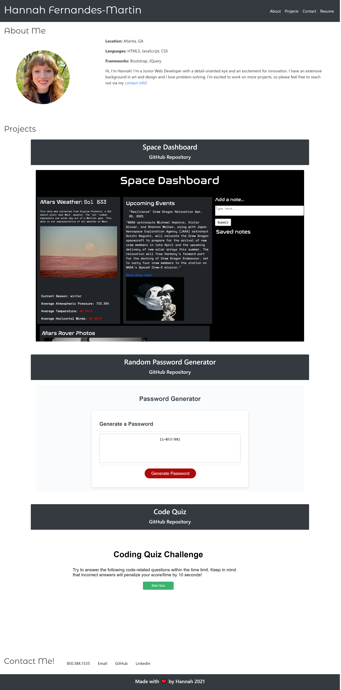

# Professional-Portfolio

<!-- Description -->

I wrote all of the code for this site. It is a portfolio site that will continue to be updated to store my work.

<!-- Screenshots -->

<!-- Link to the deployed site -->

[Professional Portfolio](https://hanfernan.github.io/Professional-Portfolio/)
